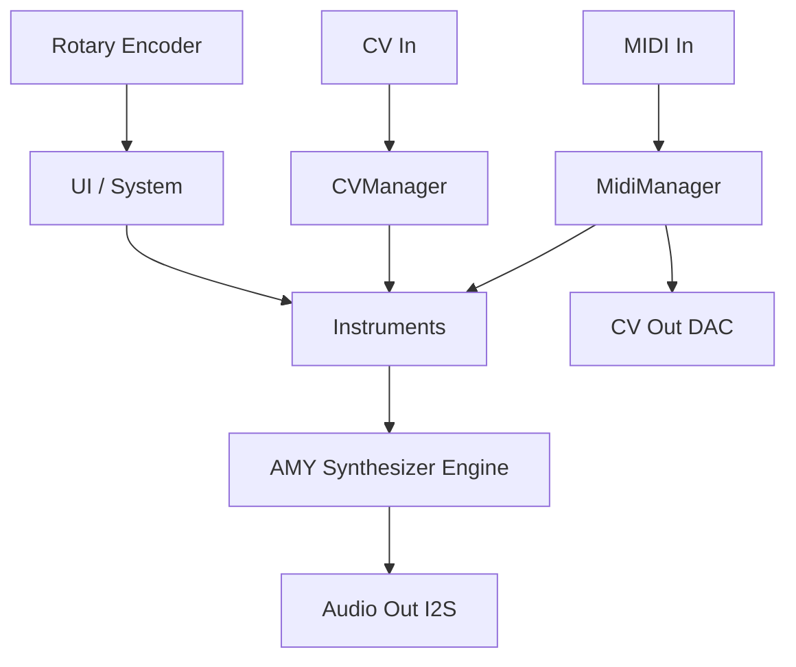

# Architecture Overview

This document outlines the software and system architecture of the AMY Rack synthesizer module.

## High-Level Block Diagram



## Component Responsibilities

- **System / UI**: Manages the main event loop, coordinates components, and handles display rendering (SH1107 OLED) and encoder input (Adafruit seesaw).
- **MidiManager**: Parses incoming MIDI data from TRS/USB, routes note events to instruments, and forwards CC/Pitchbend to the CVManager for MIDI-to-CV conversion.
- **CVManager**: Reads analog CV inputs (Gate, V/Oct) via AMY's hooks and writes to the GP8413 15-bit DAC for CV outputs.
- **Instruments**: Abstraction layer over AMY's synth allocation. Translates musical events (Note On/Off, parameter changes) into low-level AMY events (oscillators, filters, ADSR).
- **Display**: Handles U8g2 rendering of the 128x128 interface, updating at ~30 FPS.
- **Encoder**: Parses rotary rotation and button presses, integrating with UI state machines.

## Data Flow

1. **MIDI In → AMY → Audio Out**: MidiManager triggers `noteOn`/`noteOff` on the active Instrument, which schedules `amy_add_event()`. The AMY engine renders audio frames which are sent out via I2S.
2. **CV In → AMY → Notes**: CVManager polls `amy_external_coef_hook` (or ADC directly), detects Gate thresholds (2.5V high, 0.5V low) and V/Oct changes, routing them to the active Instrument.
3. **MIDI → CV Out**: MidiManager can optionally route MIDI Note or CC data to the GP8413 DAC to drive external modular gear.

## Threading Model

AMY Rack leverages the ESP32-S3's dual-core architecture via FreeRTOS:
- **Core 0**: Handles background tasks, WiFi/BT (if enabled), MIDI parsing, and input polling.
- **Core 1**: Dedicated to the main `loop()`, updating UI state, handling encoder logic, and most importantly, running `amy_update()` to render audio blocks and I2S DMA transfers uninterrupted.

## Memory Layout

- **PSRAM**: Used extensively by AMY for delay lines, reverb buffers, and large wavetables.
- **Flash**: Stores the compiled firmware and static patch data (like DX7 ROMs or Juno presets).

## AMY Integration

The system initializes AMY using a standard configuration block:
```cpp
amy_start(1 /* cores */, 1 /* reverb */, 1 /* chorus */);
```
In the main `loop()`, `amy_update()` must be called frequently to ensure the audio buffer remains full. Instrument classes manage AMY's state by sending `amy_event` structures.
