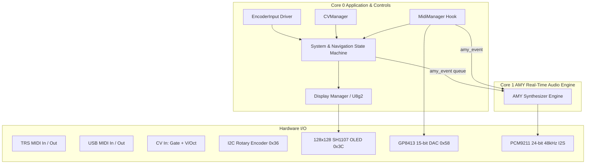

# System Architecture & Audio Engine Design

This document details the software architecture, threading model, memory layout, and synthesis pipeline of the AMY Rack Eurorack module.

---

## 1. High-Level System Architecture

---

## 2. Component Roles & Module Responsibilities

- **`System` (`System.h` / `System.cpp`)**:
  - Central coordinator managing the 6-tab navigation state machine (`TAB_SELECT`, `PARAM_SCROLL`, `PARAM_EDIT`, `INSTRUMENT_MENU`).
  - Organizes parameters across 6 tabs (`[MAIN]`, `[SYNTH]`, `[ENV]`, `[FX]`, `[MIDI]`, `[CV]`).
  - Performs synchronous audio resets (`amy_reset_oscs()`) on engine switching.
- **`Display` (`Display.h` / `Display.cpp`)**:
  - Manages the 128×128 SH1107 OLED using the U8g2 full buffer driver.
  - Implements dirty flag redraw caching (~30 FPS) to minimize CPU overhead on the control core.
  - Renders top tab navigation headers, instrument visualizers, parameter lists, and bottom status bars.
- **`EncoderInput` (`EncoderInput.h` / `EncoderInput.cpp`)**:
  - Interfaces with the Adafruit seesaw I2C chip (GPIO 24 button + quadrature encoder).
  - Implements dynamic rotational acceleration (`ENCODER_ACCEL_FACTOR`) and long-press timing (800ms) for opening the engine picker.
- **`Instrument` Base Class (`Instrument.h`)**:
  - Encapsulates synthesis behavior, parameter metadata (`ParamDescriptor`), preset switching, and AMY event dispatch.
  - Subclasses: `InstrumentDX7`, `InstrumentJuno`, `InstrumentAnalog`, `InstrumentSampler`, `InstrumentPiano`.
- **`CVManager` (`CVManager.h` / `CVManager.cpp`)**:
  - Configures AMY's `cv_trigger` system for Gate/Pitch inputs.
  - Drives the GP8413 15-bit DAC over I2C to provide bipolar -10V to +10V control voltages.
- **`MidiManager` (`MidiManager.h` / `MidiManager.cpp`)**:
  - Hooks into AMY's `amy_external_midi_input_hook` for hardware UART (GPIO 21) and USB MIDI.
  - Automatically routes MIDI note-ons to the active engine and mirrors pitch/gate to the CV outputs.

---

## 3. The 5 Synthesis Engines

| Engine | Polyphony | Synthesis Method | AMY Voice Configuration |
|---|---|---|---|
| **DX7** | 6 Voices | 6-Operator FM Synthesis | AMY FM Patches 0..127 (`e.patch_number = 0..127`, `synth = 1`) |
| **Juno-106** | 5 Voices | Virtual Analog (DCO + VCF + Sub + Noise) | 4 Sounding Oscs (`PWM`, `SAW`, `SUB`, `NOISE`) + 1 `LFO` |
| **Analog** | 6 Voices (or 1 Mono-Legato) | Dual-Oscillator Subtractive | `OSC_1`, `OSC_2`, `NOISE`, `LFO` on Patch Template `1024` |
| **Sampler** | 6 Voices | PCM Waveform Playback | 11 Built-in 808 ROM kits + 1 Live RAM recorder buffer |
| **Piano** | 4 Voices | Additive Spectral Synthesis | AMY Patch 256 (24 Harmonic partials per voice) |

---

## 4. Multi-Core Threading & Memory Architecture

AMY Rack runs on the ESP32-S3 (Dual Xtensa LX7 cores @ 240MHz):

1. **Core 0 (Control & Event Core)**:
   - Polling of Rotary Encoder (I2C 400kHz).
   - Display frame rendering via U8g2.
   - Background tasks (Sampler RAM audio capture task).
   - MIDI parsing and parameter state updates.
2. **Core 1 (Real-Time Audio Core)**:
   - Dedicated exclusively to AMY's synthesis pipeline (`amy_update()`).
   - Generates 32-sample audio blocks at 48,000Hz (or 22,050Hz internal engine clock).
   - Direct DMA transfer to PCM9211 I2S audio codec.
3. **PSRAM (8MB Octal SPI)**:
   - Dynamically stores delay lines, reverb comb/allpass filters, and the Live Sampler recording buffer (`SAMPLER_MAX_SAMPLES * sizeof(int16_t)`).
