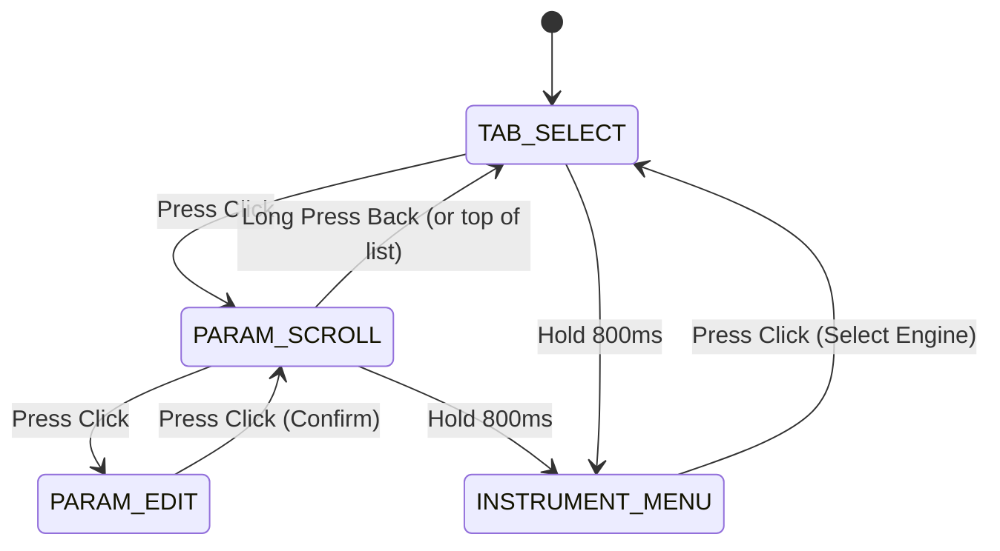

# UI Navigation & Visualizer Reference

AMY Rack features a streamlined, high-density interface optimized for a 128×128 pixel SH1107 OLED display and a single click rotary encoder.

---

## 1. Display Layout Structure

```
+----------------------------------------------------+  Y = 0
| [MAIN] [SYNTH] [ENV] [FX] [MIDI] [CV]              |  Header (Tab Navigation)
+----------------------------------------------------+  Y = 14
|                                                    |
|            INSTRUMENT VISUALIZER BOX               |  Bespoke Instrument
|      (DX7 Algos / Juno Sliders / Waveforms)        |  Area (Y: 15 to 61)
|                                                    |
+----------------------------------------------------+  Y = 62
| ▶ Cutoff: 1800 Hz                                  |
|   Resonance: 1.20                                  |  Scrollable Parameter
|   Noise Level: 0 %                                 |  List (Y: 63 to 117)
|   Osc Mix: 50 %                                    |
+----------------------------------------------------+  Y = 118
| Ch:1  Note:C4   Gate:■                             |  Status Bar (Y: 118 to 127)
+----------------------------------------------------+  Y = 127
```

---

## 2. The 6-Tab Navigation Workflow

| Tab | Parameters & Purpose |
|---|---|
| **`[MAIN]`** | **Engine** (DX7, Juno, Analog, Sampler, Piano), **Patch** (0..127 or 0..11), **Volume** (0..100%), **Voice Mode** (Poly 6V / Mono Legato) |
| **`[SYNTH]`** | **Engine Specifics**: DX7 Operators / Algorithms, Juno DCO PWM / HPF / VCF, Analog Dual Waveshapes / Detune / Mix / Noise, Sampler Record / Trim / Gain |
| **`[ENV]`** | **Envelope Controls**: Attack (1..4000ms), Decay (5..4000ms), Sustain (0..100%), Release (5..4000ms), Filter Mod Depth |
| **`[FX]`** | **Global Audio Effects**: Chorus Level, Reverb Send (Level, Liveness, Damping), Stereo Delay / Echo (Time, Feedback, Mix) |
| **`[MIDI]`** | **MIDI Configuration**: Listen Channel (Ch 1..16, Omni), Octave Transpose (-3..+3), Pitch Bend Range (1..12 semitones) |
| **`[CV]`** | **Modular CV Routing**: CV 1 In (V/Oct, Cutoff, Volume), CV 2 In (Gate, ModWheel, Res), CV 1 Out (V/Oct, Pitch), CV 2 Out (Gate, Mod) |

---

## 3. Encoder Navigation State Machine



1. **`TAB_SELECT` Mode**:
   - Turn encoder: Highlights adjacent tabs (`MAIN` $\leftrightarrow$ `SYNTH` $\leftrightarrow$ `ENV` $\leftrightarrow$ `FX` $\leftrightarrow$ `MIDI` $\leftrightarrow$ `CV`).
   - Click encoder: Enters the highlighted tab and moves focus into `PARAM_SCROLL`.
2. **`PARAM_SCROLL` Mode**:
   - Turn encoder: Scrolls up and down the parameters available in the active tab.
   - Click encoder: Enters `PARAM_EDIT` mode for the highlighted parameter.
3. **`PARAM_EDIT` Mode**:
   - Turn encoder: Adjusts the numerical or enum value. Rapid turns engage dynamic acceleration (`ENCODER_ACCEL_FACTOR = 5`).
   - Click encoder: Confirms change and returns to `PARAM_SCROLL`.
4. **`INSTRUMENT_MENU` Mode (Long Press)**:
   - Holding the encoder button for $\ge$ 800ms opens the full-screen Instrument Selector overlay.
   - Turn to preview any of the 5 engines, click to immediately switch.

---

## 4. Bespoke Visualizers by Engine

- **DX7**: Renders the complete 6-operator FM algorithm tree with interactive active routing lines and carrier/modulator operator numbers.
- **Juno-106**: Displays horizontal slider bars with DCO pulse-width indicators, HPF cutoff steps, VCF cutoff/res meters, and dynamic ADSR curve previews.
- **Analog**: Dual real-time oscilloscope waveform windows rendering exact shapes for Sine, Pulse, Saw, Triangle, and Noise with visual balance bar and detune percentage.
- **Sampler**:
  - *ROM Patches (0..10)*: Procedural transient/decay curves for 808 Kick, Snares, Hats, Clap, Tom, Cowbell, Maraca with sample duration tags.
  - *Live Recorder (11)*: Animated `[ * RECORDING... * ]` progress meter when capturing, and true audio waveform rendering with draggable start/end vertical trim markers.
- **Additive Spectral Piano**: High-contrast 14-key animated piano keyboard layout with sharp black/white key geometry.
